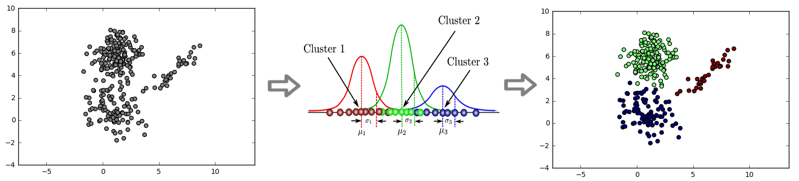
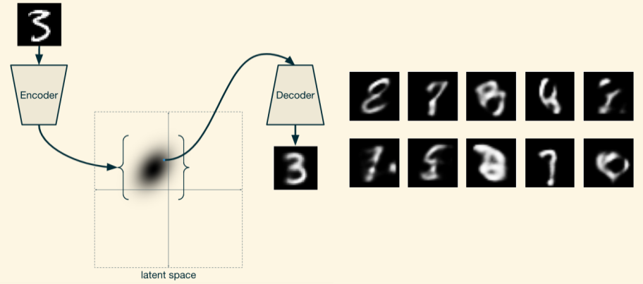
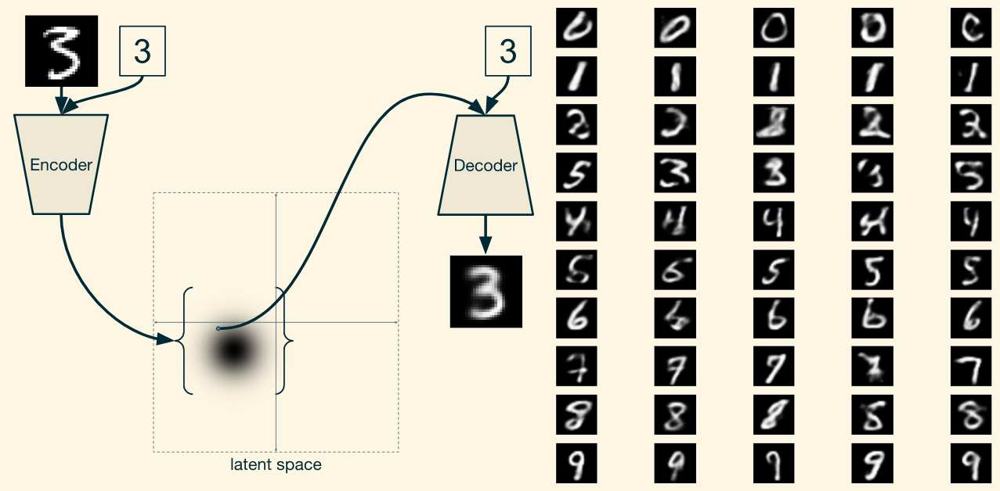
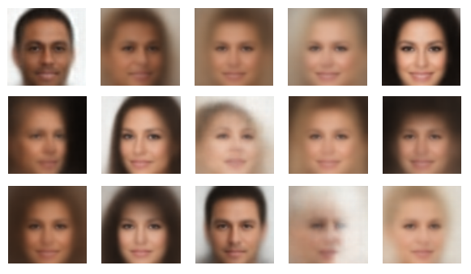
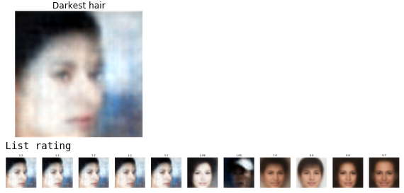
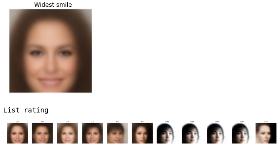

# Bayesian Methods Machine Learning

[Bayesian course](https://www.coursera.org/learn/bayesian-methods-in-machine-learning) from Coursera

1. Introduction to Bayesian methods & Conjugate priors

2. Expectation-Maximization algorithm

3. Variational Inference & Latent Dirichlet Allocation

4. Markov chain Monte Carlo

5. Variational Autoencoder
6. Gaussian processes & Bayesian optimization

Clustering with Gaussian Mixture Model

Conditional Variational Autoencoder (CVAE)

- VAE

	

- CVAE

Simple Regression Problem Fit by Gaussian Process

Finding the Suspect Project (Facial composits)

- Random sampling faces

  

- Finding person with darkest hair

  

- Finding person with the widest smile

  