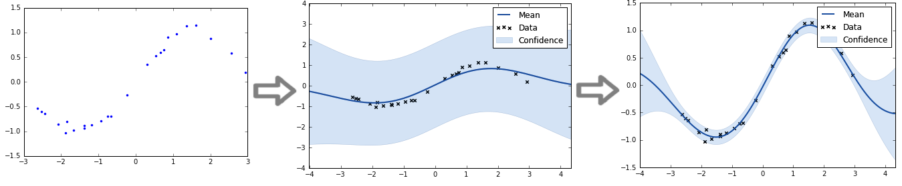

# Bayesian Methods Machine Learning

[Bayesian course](https://www.coursera.org/learn/bayesian-methods-in-machine-learning) from Coursera

1. Introduction to Bayesian methods & Conjugate priors

2. Expectation-Maximization algorithm

3. Variational Inference & Latent Dirichlet Allocation

4. Markov chain Monte Carlo

5. Variational Autoencoder
6. Gaussian processes & Bayesian optimization

Clustering with Gaussian Mixture Model, [here](https://github.com/DarwinSaire/bayesian-methods-machine-learning/blob/main/week2/Coursera%20BMML%2C%20week%202.ipynb)

Conditional Variational Autoencoder (CVAE), [here](https://github.com/DarwinSaire/bayesian-methods-machine-learning/blob/main/Week5/Coursera%20BMML%2C%20week%205.ipynb)

- VAE

	

- CVAE

Simple Regression Problem Fit by Gaussian Process, [here](https://github.com/DarwinSaire/bayesian-methods-machine-learning/blob/main/Week6/Coursera%20BMML%2C%20week%206.ipynb)

Finding the Suspect Project (Facial composits), [here](https://github.com/DarwinSaire/bayesian-methods-machine-learning/blob/main/Coursera-BMML-Final-project/Coursera%20BMML%2C%20Final%20project.ipynb)

- Random sampling faces

  

- Finding person with darkest hair

  

- Finding person with the widest smile

  